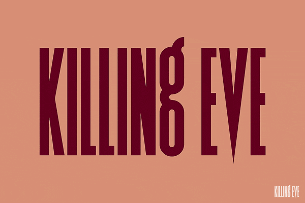

# Killing Eve

This is a reference of what I want to replicate.

[This video compilation](https://www.youtube.com/watch?v=Ef9VRTJ63_U) shows the different incarnations of the title.

For each episode, the title varies in the following ways:
- The background color and the text color;
- The oozing blood trail is runs down a different characters (either the 'K', 'N', or 'V');
- The accompanying song. The music selection is exemplary.

What I want to do is create a similar montage to the video, but make it random. The colors, the oozing blood trail character, and the song will be chosen at random each time.

## Design Decisions

I wrote an article about [this topic](https://roboleary.net/2020/12/24/title-sequences.html).

## Attribution

Audio sampled from:
1. Xpectation by Unloved.
1. Voodoo Voodoo by Etienne Daho.
1. Killer Shangri-Lah by Pshycotic Beats.

The audio is the property of the copyright holders. Samples are used here as a commentary of how well-chosen the songs are for the title sequence. It is deemed to be fair usage with no copyright infringement intended.
