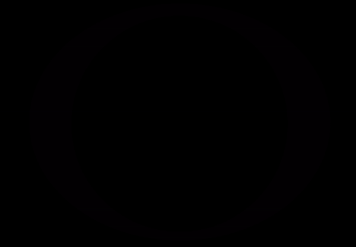
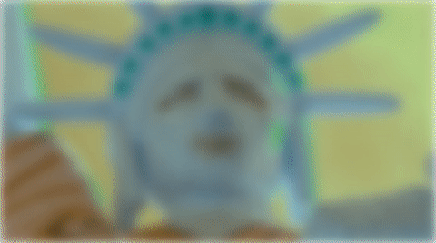
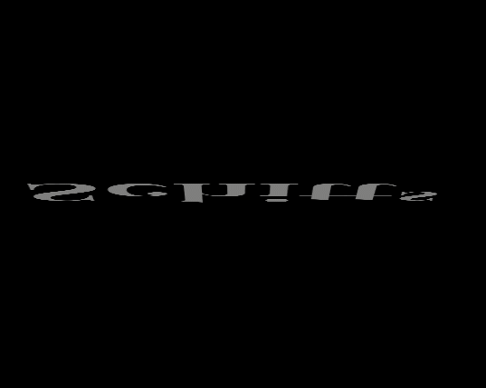
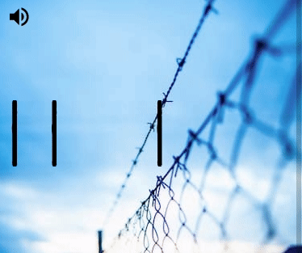
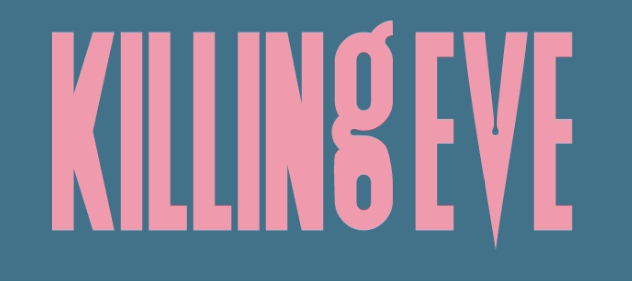
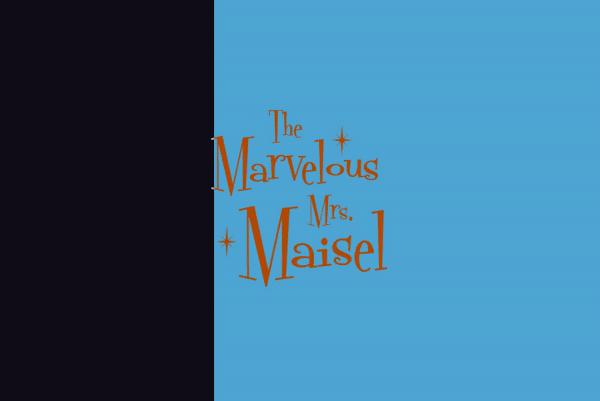
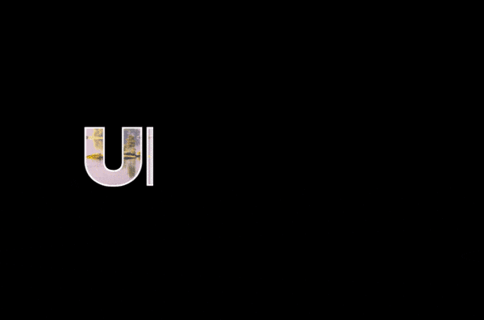

# Title sequences (TV shows and movies)

This project creates web versions of the title sequences from TV Shows and Movies. The aim is to improve my CSS and animation chops.

I have bundled the project with [vite](https://vitejs.dev/), so it can be **run locally as a mini-website**. Also, [**you can view them all in a collection on codepen**](https://codepen.io/collection/nNmwgP).

## Run the project

To clone and run the project, run the following:

```bash
git clone https://github.com/robole/title-sequences
cd title-sequences
npm i
npm run dev
```

The website is run on: <http://localhost:3000/>.

If you open the project in VS Code, there is an included [task](https://code.visualstudio.com/Docs/editor/tasks) that will start the dev server every time you open the project. The first time you open the project, you may need to run the command **"Tasks: Manage Automatic Tasks in Folder"** to enable it.

Otherwise, you can run the command `npm run dev` to start the dev server yourself, once you have installed the dependecies.

## Title sequences

So far, these are the title sequences:

1. [Ozark](#ozark)
1. [Better Call Saul](#better-call-saul)
1. [Schitt's Creek](#schitts-creek)
1. [Orange is The New Black](#orange-is-the-new-black)
1. [Killing Eve](#killing-eve)
1. [The Marvelous Mrs Maisel](#the-marvelous-mrs-maisel)
1. [Upload](#upload)

### Ozark

[Ozark](<https://en.wikipedia.org/wiki/Ozark_(TV_series)>) is an American crime drama streaming television series created by Bill Dubuque and Mark Williams for Netflix. The series follows Marty and Wendy Byrde, a married couple who move their family to the Lake of the Ozarks to create a big money laundering operation for a Mexican drug cartel.

This instance is based on Season 1 Episode 1.



View the [codepen](https://codepen.io/robjoeol/full/yLVZbwQ).

#### How was this made?

I discuss it all in this article, [How to create a slick animation from Ozark (TV series title sequence))](https://www.roboleary.net/2022/01/22/ozark-animation.html)!

I used the [Greensock (GSAP)](https://greensock.com/) library for the animation.

### Better Call Saul

[Better Call Saul](https://en.wikipedia.org/wiki/Better_Call_Saul) is an American crime drama television series. It is a spin-off, prequel, and a sequel to [Breaking Bad](https://en.wikipedia.org/wiki/Breaking_Bad). Set primarily in the early to middle part of the 2000s in Albuquerque, New Mexico, the series follows Jimmy McGill (Bob Odenkirk), an earnest lawyer and former con artist, as he becomes an egocentric criminal defense attorney known as Saul Goodman.



View the [codepen](https://codepen.io/robjoeol/full/rNWRoBO).

#### Typography

Two typefaces are used for the title of the TV series. The text “Better Call” uses [_Script1 Script Casual_](https://fontmeme.com/fonts/script1-script-casual-font/) in italics. The text “Saul” uses a cursive font that is very similar to [_Dancing Script_](https://fonts.google.com/specimen/Dancing+Script?preview.text_type=custom).

The credits use [VCR OSD Mono](https://www.dafont.com/vcr-osd-mono.font).

#### How was this made?

I used the [Greensock (GSAP)](https://greensock.com/) library for the animation.

#### Optimizing animation

The animation could be optimized further. The following could be done:

1. At the beginning of the animation, the title is blurry and comes into focus. This is done by animating `filter:blur()`. It would probably be more performant to overlay a blurry version of the background, and animate the opacity on that instead.
1. There is a separate animation timeline that moves a duplicate of the background image (Lady Liberity) to create some subtle movement. It may be more performant to turn this into a GIF, but for a large GIF the file size might be significant. This tradeoff may not be worth making.

### Schitts Creek

[Schitt's Creek](https://en.wikipedia.org/wiki/Schitt's_Creek) is a Canadian sitcom television series created by Dan Levy and Eugene Levy, that aired from 2015 to 2020.  The series follows the formerly wealthy Rose family's trials and tribulations.



View the [codepen](https://codepen.io/robjoeol/full/dypyEdJ).

#### How was this made?

I discuss it all in this article, [How to create a slick animation from Schitt's Creek (TV series title sequence)](https://www.roboleary.net/animation/2022/10/31/how-to-make-a-slick-animation-schitts-creek-title-sequence.html)!

I used the [Greensock (GSAP)](https://greensock.com/) library for the animation.

### Orange Is The New Black

[Orange Is the New Black](https://en.wikipedia.org/wiki/Orange_Is_the_New_Black) is an American comedy-drama television series created by Jenji Kohan for Netflix. The series is based on [Piper Kerman's memoir Orange Is the New Black: My Year in a Women's Prison (2010)](https://en.wikipedia.org/wiki/Orange_Is_the_New_Black:_My_Year_in_a_Women%27s_Prison), about her experiences at FCI Danbury, a minimum-security federal prison.

I took the final sequence in the [opening title](https://www.youtube.com/watch?v=fBITGyJynfA).



View the [codepen](https://codepen.io/robjoeol/full/VwKLPRR).

#### How was this made?

The animation is a CSS animation, but uses JavaScript to toggle a class to trigger the animation.

#### Design decisions

- The original typeface is _Damaged Guts_. I chose a free alternative called _CF Punk Fashion_ as a basis for making my own text. I converted the text to SVG paths and added more "damage" to get closer to the look of the original!
- I chose to do the animation in CSS, but have it triggered by JavaScript. I did begin by using GSAP and noticed that the equivalent of `translateX(50%)` didn't work as expected. It works as expected in CSS. I don't know why!

#### Attribution

- [Photo](https://unsplash.com/photos/WWX2bPqP-z4) by [Markus Spiske](https://unsplash.com/@markusspiske?utm_source=unsplash&utm_medium=referral&utm_content=creditCopyText).
- [Door closing sound effect](https://freesound.org/people/TurtleLG/sounds/80449/) from Freesound.org.

### Killing Eve

[Killing Eve](https://en.wikipedia.org/wiki/Killing_Eve) is a British spy thriller television series, produced in the United Kingdom for BBC America and BBC Three. The series follows Eve Polastri (Sandra Oh), a British intelligence investigator tasked with capturing psychopathic assassin Villanelle (Jodie Comer).



View the [codepen](https://codepen.io/robjoeol/full/gOwGojN).

#### How was this made?

I explain how in this article, [How to create a slick animation from Killing Eve (TV show title sequence)](https://www.roboleary.net/2020/12/24/title-sequences.html)!

I used the [Greensock (GSAP)](https://greensock.com/) library for the animation.

#### Attribution

The audio is sampled from:

1. Xpectation by Unloved.
1. Voodoo Voodoo by Etienne Daho.
1. Killer Shangri-Lah by Pshycotic Beats.

The audio is the property of the copyright holders. Samples are used here as a commentary of how well-chosen the songs are for the title sequence. It is deemed to be fair usage. No copyright infringement is intended.

### The Marvelous Mrs Maisel

[The Marvelous Mrs. Maisel](https://en.wikipedia.org/wiki/The_Marvelous_Mrs._Maisel) is an American period comedy-drama television series. It is set in the late 1950s and early 1960s, it stars Rachel Brosnahan as Miriam "Midge" Maisel, a New York housewife who discovers she has a knack for stand-up comedy and pursues a career in it.

This instance is the opening title from Episode 2 of Season 4



View the [codepen](https://codepen.io/robjoeol/full/yLvopZe).

#### How was this made?

I explain how in this article, [How to create a slick CSS animation from The Marvelous Mrs Maisel (TV series title sequence)](https://www.roboleary.net/2022/05/23/how-to-make-a-slick-animation-the-marvelous-mrs-maisel-title-sequence.html)!

It is a CSS animation.

#### Attribution

I use the font [Fontdinerdotcom](https://fontmeme.com/fonts/fontdinerdotcom-font/). This is free for personal use only.

### Upload

[Upload](https://en.wikipedia.org/wiki/Upload_(TV_series)) is an American science fiction comedy-drama television series created by Greg Daniels. The story takes place in 2033, when humans can "upload" themselves into a virtual afterlife of their choosing. When a programmer Nathan Brown dies prematurely, he is uploaded to the very expensive Lakeview, but then finds himself under the thumb of his possessive, still-living girlfriend Ingrid.



View the [codepen](https://codepen.io/robjoeol/full/PoQRgLG).

#### How was this made?

I explain how in this article, [How to create a slick CSS animation from The Marvelous Mrs Maisel (TV series title sequence)](https://www.roboleary.net/2022/06/06/how-to-make-a-slick-css-animation-upload-title-sequence.html)!

It is a CSS animation.
