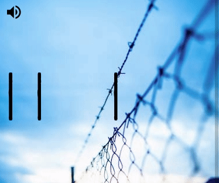

# Title sequences (TV shows and movies)

This project creates web versions of the title sequences from TV Shows and Movies. The aim is to improve my CSS and animation chops.

I have bundled the project with [vite](https://vitejs.dev/), so it can be **run locally as a mini-website**. Also, [**you can view them all in a collection on codepen**](https://codepen.io/collection/nNmwgP).

## Run the project

To clone and run the project, run the following:

```bash
git clone https://github.com/robole/title-sequences
cd title-sequences
npm i
npm run dev
```

The website is run on: <http://localhost:3000/>.

If you open the project in VS Code, there is an included [task](https://code.visualstudio.com/Docs/editor/tasks) that will start the dev server every time you open the project. The first time you open the project, you may need to run the command **"Tasks: Manage Automatic Tasks in Folder"** to enable it.

Otherwise, you can run the command `npm run dev` to start the dev server yourself, once you have installed the dependecies.

## Title sequences

### Ozark

[Ozark](<https://en.wikipedia.org/wiki/Ozark_(TV_series)>) is an American crime drama streaming television series created by Bill Dubuque and Mark Williams for Netflix. The series follows Marty and Wendy Byrde, a married couple who move their family to the Lake of the Ozarks to create a big money laundering operation for a Mexican drug cartel.


View the [codepen](https://codepen.io/robjoeol/full/yLVZbwQ).

### Better Call Saul

[Better Call Saul](https://en.wikipedia.org/wiki/Better_Call_Saul) is an American crime drama television series. It is a spin-off, prequel, and a sequel to [Breaking Bad](https://en.wikipedia.org/wiki/Breaking_Bad). Set primarily in the early to middle part of the 2000s in Albuquerque, New Mexico, the series follows Jimmy McGill (Bob Odenkirk), an earnest lawyer and former con artist, as he becomes an egocentric criminal defense attorney known as Saul Goodman.


View the [codepen](https://codepen.io/robjoeol/full/rNWRoBO).

### Schitts Creek

[Schitt's Creek](https://en.wikipedia.org/wiki/Schitt's_Creek) is a Canadian sitcom television series created by Dan Levy and Eugene Levy, that aired from 2015 to 2020.  The series follows the formerly wealthy Rose family's trials and tribulations.


View the [codepen](https://codepen.io/robjoeol/full/dypyEdJ).

### Orange Is The New Black

[Orange Is the New Black](https://en.wikipedia.org/wiki/Orange_Is_the_New_Black) is an American comedy-drama television series created by Jenji Kohan for Netflix. The series is based on [Piper Kerman's memoir Orange Is the New Black: My Year in a Women's Prison (2010)](https://en.wikipedia.org/wiki/Orange_Is_the_New_Black:_My_Year_in_a_Women%27s_Prison), about her experiences at FCI Danbury, a minimum-security federal prison.



View the [codepen](https://codepen.io/robjoeol/full/VwKLPRR).

### Killing Eve

[Killing Eve](https://en.wikipedia.org/wiki/Killing_Eve) is a British spy thriller television series, produced in the United Kingdom for BBC America and BBC Three. The series follows Eve Polastri (Sandra Oh), a British intelligence investigator tasked with capturing psychopathic assassin Villanelle (Jodie Comer).


I discuss how I created this in the article, [How to create slick TV show title sequences](https://www.roboleary.net/2020/12/24/title-sequences.html).

View the [codepen](https://codepen.io/robjoeol/full/gOwGojN).
