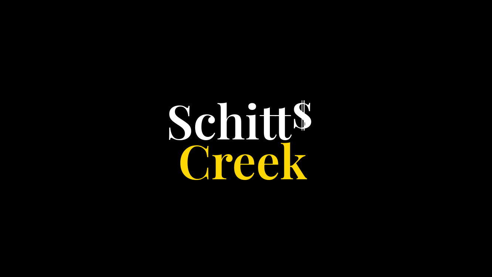
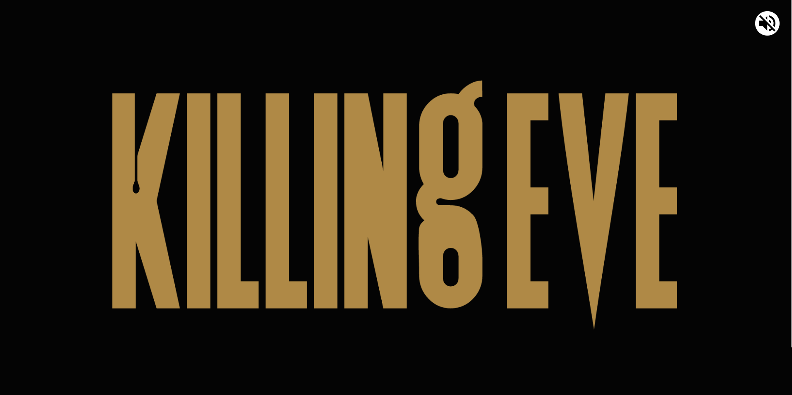
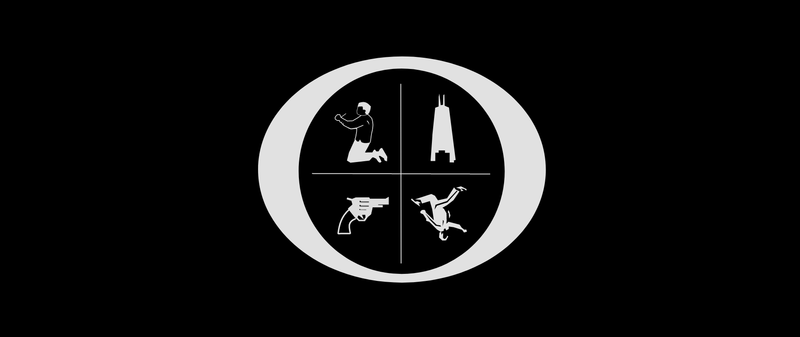
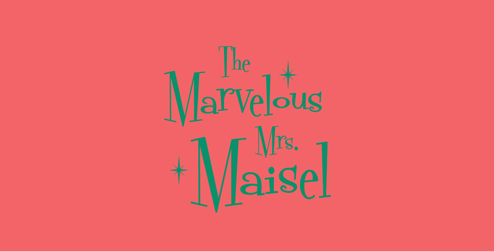
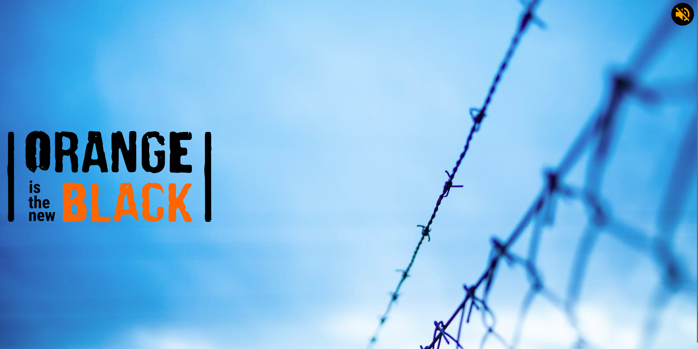

# Title sequences (TV shows and movies)

This project creates web versions of the title sequences from TV Shows and Movies. The aim is to improve my CSS and animation chops.

You can **view all of the title sequences in [this collection on codepen](https://codepen.io/collection/nNmwgP)**.

## Run the project

You can run the **project locally as a mini-website**. To run the project: clone the repo, install the dependencies with your package manager of choice, and run the dev server with `dev` npm script.

```shell
# using npm
npm i 
npm run dev
```

The website is run by default on: <http://localhost:3000/>.

## Title sequences

So far, these are the title sequences:

<!-- TOC -->
1. [Schitts Creek](#schitts-creek)
1. [Alien](#alien)
1. [Better Call Saul](#better-call-saul)
1. [Jackie Brown](#jackie-brown)
1. [Killing Eve](#killing-eve)
1. [Ozark](#ozark)
1. [The Marvelous Mrs Maisel](#the-marvelous-mrs-maisel)
1. [Upload](#upload)
1. [Stranger Things](#stranger-things)
1. [Cocktail](#cocktail)
1. [Orange Is The New Black](#orange-is-the-new-black)
<!-- /TOC -->

### Schitts Creek

[Schitt's Creek](https://en.wikipedia.org/wiki/Schitt's_Creek) is a Canadian sitcom television series that aired from 2015 to 2020. The series follows the formerly wealthy Rose family's trials and tribulations.



View the [codepen](https://codepen.io/robjoeol/full/dypyEdJ).

#### Implementation notes

I created 2 versions:
1. Using the [Greensock (GSAP)](https://greensock.com/) library that features the soundtrack. See [schitts-creek/gsap folder](schitts-creek/gsap) for code.
1. A CSS version without the soundtrack. See [schitts-creek/css folder](schitts-creek/css) for code.

You can read my [notes](https://www.roboleary.net/animation/2022/10/31/how-to-make-a-slick-animation-schitts-creek-title-sequence.html) for more info.

### Alien

Alien is a 1979 science fiction horror film directed by Ridley Scott.


View the [codepen](https://codepen.io/robjoeol/full/ZEZXabR).

#### Implementation notes

It is a CSS animation. You can read [my notes](https://www.roboleary.net/2024/05/15/alien-title-sequence.html) about the design and implementation.

### Better Call Saul

[Better Call Saul](https://en.wikipedia.org/wiki/Better_Call_Saul) is an American crime drama television series.


View the [codepen](https://codepen.io/robjoeol/full/rNWRoBO).

#### Implementation notes

I used the [Greensock (GSAP)](https://greensock.com/) library for the animation. You can read my [notes](http://roboleary.net/animation/2023/05/15/a-slick-animation-better-call-saul-title-sequence.html) for more details.

### Jackie Brown

Jackie Brown is an American crime film written and directed by Quentin Tarantino.


View the [codepen](https://codepen.io/robjoeol/pen/BaEdVwj).

#### Implementation notes

It is a CSS animation. You can read [my notes](https://www.roboleary.net/2024/04/15/jackie-brown-title-sequence.html) about the design and implementation.

### Killing Eve

[Killing Eve](https://en.wikipedia.org/wiki/Killing_Eve) is a British spy thriller television series. The series follows Eve Polastri (Sandra Oh), a British intelligence investigator tasked with capturing psychopathic assassin Villanelle (Jodie Comer).



View the [codepen](https://codepen.io/robjoeol/full/gOwGojN).

#### Implementation notes

I used the [Greensock (GSAP)](https://greensock.com/) library for the animation. You can read my [notes](https://www.roboleary.net/2020/12/24/title-sequences.html) for more info.

### Ozark

[Ozark](<https://en.wikipedia.org/wiki/Ozark_(TV_series)>) is an American crime drama. The series follows Marty and Wendy Byrde, a married couple who move their family to the Lake of the Ozarks to create a big money laundering operation for a Mexican drug cartel.

This instance is based on Season 1 Episode 1.



View the [codepen](https://codepen.io/robjoeol/full/yLVZbwQ).

#### Implementation notes

I used the [Greensock (GSAP)](https://greensock.com/) library for the animation. You can read my [notes](https://www.roboleary.net/2022/01/22/ozark-animation.html) for more info.

### The Marvelous Mrs Maisel

[The Marvelous Mrs. Maisel](https://en.wikipedia.org/wiki/The_Marvelous_Mrs._Maisel) is an American period comedy-drama television series. It is set in the late 1950s.

This instance is the opening title from Episode 2 of Season 4



View the [codepen](https://codepen.io/robjoeol/full/yLvopZe).

#### Implementation notes

It is a CSS animation. You can read my [notes](https://www.roboleary.net/2022/05/23/how-to-make-a-slick-animation-the-marvelous-mrs-maisel-title-sequence.html) for more info.

### Upload

[Upload](<https://en.wikipedia.org/wiki/Upload_(TV_series)>) is an American science fiction comedy-drama television series. The story takes place in 2033, when humans can "upload" themselves into a virtual afterlife of their choosing.


View the [codepen](https://codepen.io/robjoeol/full/PoQRgLG).

#### Implementation notes

It is a CSS animation. You can my [notes](https://www.roboleary.net/2022/06/06/how-to-make-a-slick-css-animation-upload-title-sequence.html) for more info!

### Stranger Things

[Stranger Things](https://en.wikipedia.org/wiki/Stranger_Things) is an American science fiction horror drama television series.


View the [codepen](https://codepen.io/robjoeol/pen/xxyNJWP).

#### Implementation notes

I used the [Greensock (GSAP)](https://greensock.com/) library for the animation. You can read my [notes](https://www.roboleary.net/animation/2023/05/30/how-to-make-a-slick-animation-stranger-things-title-sequence.html) for more info!

### Cocktail

[Cocktail](https://en.wikipedia.org/wiki/Cocktail_(1988_film)) is a 1988 American romantic comedy-drama film starring Tom Cruise.


View the [codepen](https://codepen.io/robjoeol/pen/WNWZBKx).

#### Implementation notes

This is a CSS animation. You can read [my notes](https://www.roboleary.net/2024/04/24/cocktail-title-sequence.html) on the implementation.

### Orange Is The New Black

[Orange Is the New Black](https://en.wikipedia.org/wiki/Orange_Is_the_New_Black) is an American comedy-drama television series.

I took the final sequence in the [opening title](https://www.youtube.com/watch?v=fBITGyJynfA).



View the [codepen](https://codepen.io/robjoeol/full/VwKLPRR).

#### Implementation notes

The animation is a CSS animation, but uses JavaScript to toggle a class to trigger the animation.

- The original typeface is _Damaged Guts_. I chose a free alternative called _CF Punk Fashion_ as a basis for making my own text. I converted the text to SVG paths and added more "damage" to get closer to the look of the original!
- I chose to do the animation in CSS, but have it triggered by JavaScript. I did begin by using GSAP and noticed that the equivalent of `translateX(50%)` didn't work as expected. It works as expected in CSS. I don't know why!

## Attribution and disclaimer

All fonts used are free to use. Some are free only for personal use including:
- [Fontdinerdotcom](https://fontmeme.com/fonts/fontdinerdotcom-font/) used for The Marvelous Mrs Maisel title,
- [ITC Benguiat](https://www.fontreach.com/itc-benguiat-font-free-download/) used for Stranger Things.

I have taken some clips from songs to accompany some of the titles. The songs are the property of the copyright holders. Samples are used here as a commentary of how well-chosen the songs are for the title sequence. It is deemed to be fair usage. No copyright infringement is intended. Here is a list of songs sampled:
- For Killing Eve:
	- Xpectation by Unloved.
	- Voodoo Voodoo by Etienne Daho.
	- Killer Shangri-Lah by Pshycotic Beats.
- For Schitts Creek:
	- Main Theme by Maribeth Solomon
- For Stranger Things:
	- The theme song is by Kyle Dixon and Michael Stein.
