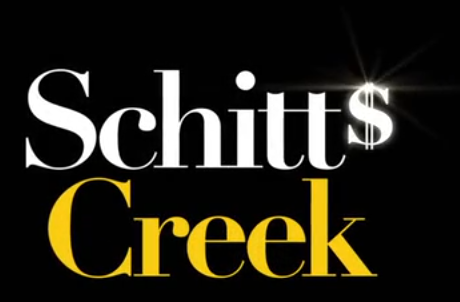

# Schitts Creek

I took the final sequence in the [opening title](https://www.youtube.com/watch?v=xhRpLYYfgy0).

See [live demo](https://codepen.io/robjoeol/full/VwKLPRR).

## Design Decisions

- The original typeface used is [Linotype Didot](https://www.myfonts.com/fonts/linotype/didot/). I found a suitable alternative in [Playfair Display](https://fonts.google.com/specimen/Playfair+Display).
- I simplified the sparkle above the S glyph. It uses 2 diagonal beams, but it happens so fast, it makes little difference. The original is more intricate (as below).

- I chose to use GSAP. For timeline stuff, it takes the headaches out of coordination.
